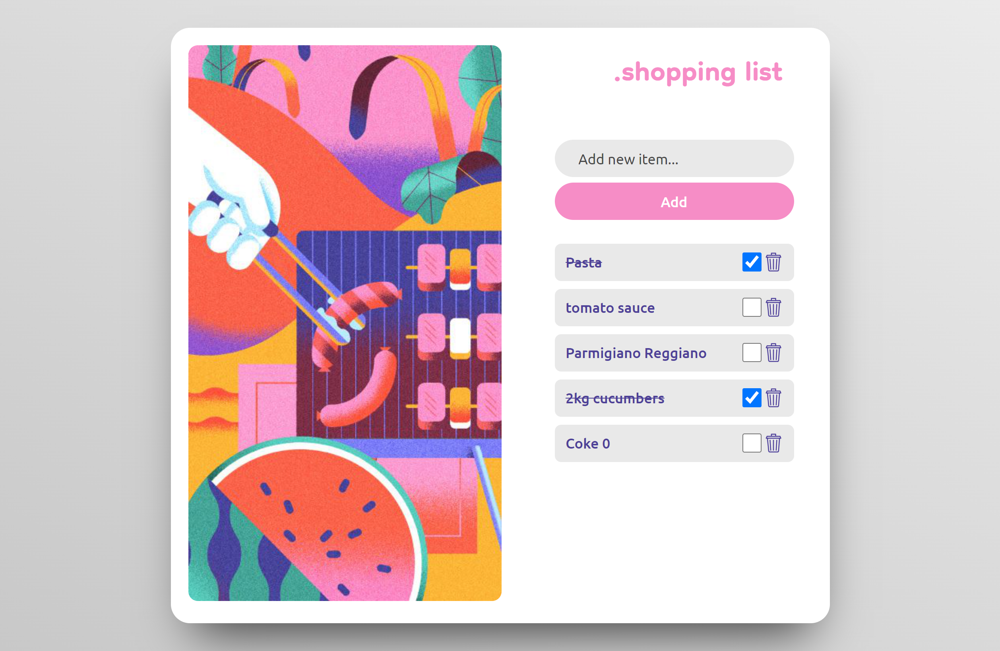

## React Shopping List
The React Shopping List is a basic application that allows users to input items they want to buy into an input field, which then gets displayed on a list. Users have the option to mark items as purchased, which will cross them out, or they can delete items to remove them completely.

### desktop overview layout
